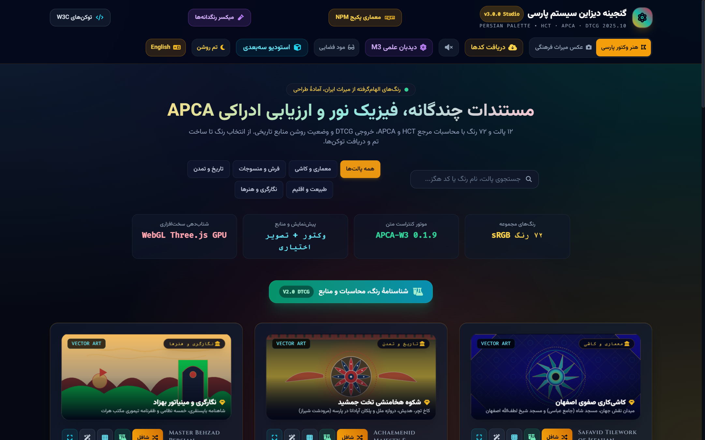
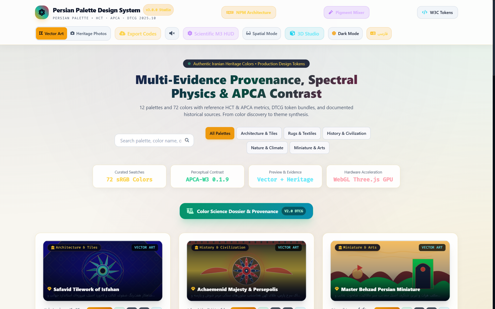

# Persian Palette (Manshour)

**12 Persian-inspired palettes, 72 sRGB colors**, a Persian/English studio, and a TypeScript library for color calculations and design-token exports.

[](https://github.com/AdzeemDigital/persian-palette/actions/workflows/ci.yml)
[](LICENSE)

[فارسی](README.fa.md) · [Quick start](docs/QUICKSTART.md) · [API reference](docs/API_REFERENCE.md) · [Contributing](CONTRIBUTING.md)

## Capabilities

- Persian/Arabic name normalization, English names and stable color IDs, with errors for missing or ambiguous queries.
- HCT/CAM16 and Material Tonal Spot through Google's Material Color Utilities, APCA-W3 contrast and digital Oklab interpolation.
- DTCG 2025.10 consumed by Style Dictionary 5, Tailwind v3/v4 exports, and generated SwiftUI/Kotlin source.
- Separate Tokens Studio JSON and a documented Figma interchange format.
- A studio with embedded JavaScript, CSS, fonts and icons, light/dark themes, previews and export tools.

This is an early-stage public project. Its contribution is reusable Persian-inspired tooling; broad adoption and laboratory authentication are not claimed.

## Data provenance and limits

The [generated data-quality report](packages/core/tokens/data-quality.json) records **72 unverified heritage annotations, zero measured spectra, and 11 colors with conflicting coordinates**. Historical names, material descriptions and coordinates await independent verification. Digital HEX values are curated design choices. Spectral curves and textures are illustrative; Oklab interpolation does not model physical pigment mixing.

APCA estimates screen-text contrast; it does not certify Persian-font readability or full WCAG compliance. Figma import and native Swift/Kotlin compilation have not been validated in their target applications. See [verification scope](docs/verification.md) and [methods](docs/DESIGN_SYSTEM.md).

## Run the studio

Requires Node.js 22 or newer. From a clone or extracted release:

```sh
git clone https://github.com/AdzeemDigital/persian-palette.git
cd persian-palette
npm start
```

Open [the local studio](http://127.0.0.1:4173). The checked-in HTML needs no dependency installation to run. Both [the default edition](code_artifact.html) and [English edition](code_artifact_en.html) embed their runtime assets; optional external photographs and maps need connectivity. Camera and clipboard behavior depend on browser support and permissions.

## Use the library

Install the tarball from the [GitHub release](https://github.com/AdzeemDigital/persian-palette/releases/tag/v3.0.0), or use the one in this checkout:

```sh
npm install ./release/persian-palette-core-3.0.0.tgz
```

This is a local installation; public npm registry publication is not claimed. ESM, CommonJS and conditional TypeScript declarations are provided.

<!-- test:esm -->
```js
import { PersianEngine, calculateAPCA, generateM3DynamicScheme, mixColors } from '@persian-palette/core';
const turquoise = PersianEngine.getColor('isfahan-tiles', 'فیروزه‌ای اصیل');
console.log(turquoise.nameEn, turquoise.hex); // Persian Turquoise, #30D5C8
console.log(turquoise.evidence.provenance.heritageStatus); // unverified
console.log(calculateAPCA('#120A8F', '#F4F1DE')); // about 90.68 Lc
console.log(mixColors('#120A8F', '#F4C430', 0.4).hex); // #5C6888
const scheme = generateM3DynamicScheme(turquoise.hex);
console.log(scheme.light.primary, scheme.dark.primary);
```

Working integration examples are in [Quick start](docs/QUICKSTART.md).

## Build and verify

```sh
npm ci
npm --prefix packages/core ci
npm run check
npm run pack:core
npm run verify:package
```

CI targets Ubuntu/Windows and Node.js 22/24. It builds both HTML editions, runs tests and executable documentation examples, and installs the tarball in an isolated consumer to check ESM, CommonJS, exports and TypeScript types. **Configured checks are not evidence of a successful run.** Inspect [Actions](https://github.com/AdzeemDigital/persian-palette/actions/workflows/ci.yml) for the tested commit.

Run `npm run pack:studio` after packaging to create the source ZIP (Python 3 required). Original v3.0.0 release assets are retained; CI artifacts represent their workflow's commit.

## Preview

These images illustrate the studio; they are not accessibility or runtime audit reports.




## About and Maintenance

Maintained by Majid ZeidAbadiNejad at Adzeem Digital.
This project uses AI assistance (Google Antigravity, Claude, and OpenAI Codex) for code generation, mathematical models, audit diagnostics, and test automation under human architectural oversight.

## Contribute and license

See the [roadmap](docs/ROADMAP.md) and [contribution instructions](CONTRIBUTING.md). Source corrections should provide citations and distinguish documentary research from measurement.

Original project code is [MIT licensed](LICENSE). Dependencies retain their own licenses, including APCA-W3's terms and colorparsley's AGPL v3 license; see [third-party notices](THIRD_PARTY_NOTICES.md).

